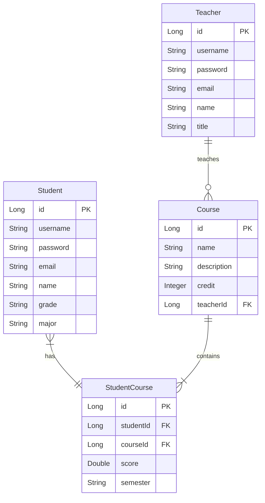

```mermaid
erDiagram
    Teacher ||--o{ Course : teaches
    Student }|--|| StudentCourse : has
    Course ||--|{ StudentCourse : contains
    
    Teacher {
        Long id PK
        String username
        String password
        String email
        String name
        String title
    }
    
    Student {
        Long id PK
        String username
        String password
        String email
        String name
        String grade
        String major
    }
    
    Course {
        Long id PK
        String name
        String description
        Integer credit
        Long teacherId FK
    }
    
    StudentCourse {
        Long id PK
        Long studentId FK
        Long courseId FK
        Double score
        String semester
    }
```